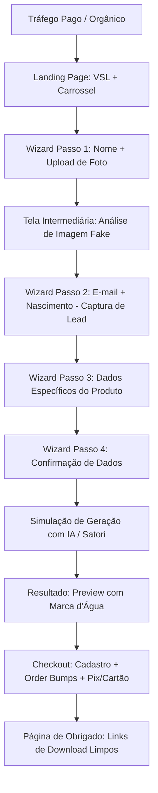

# Manual de Replicação: Funil de Alta Conversão de Produtos Personalizados

Este documento fornece um guia completo de engenharia reversa, análise de marketing e arquitetura técnica baseado no projeto **FigurinhaApp**. Ele descreve como reutilizar este modelo de negócio (Micro-SaaS/Infoproduto de customização instantânea) para vender qualquer outro tipo de produto personalizado.

---

## 1. Arquitetura do Projeto e Fluxo Operacional

O projeto utiliza **Next.js** com a estrutura **App Router**, ideal para funis de vendas devido à sua velocidade de carregamento (essencial para tráfego pago via Instagram/TikTok) e processamento dinâmico no servidor.



### Principais Componentes Técnicos
1. **Banco de Dados (Prisma + SQLite/PostgreSQL)**:
   * **`Lead`**: Registra as informações do cliente *antes* da compra (nome, e-mail, foto e dados adicionais). Capturar esses dados no Passo 2 do formulário é crucial para **recuperação de carrinho abandonado** por e-mail ou WhatsApp.
   * **`Order`**: Vincula o lead ao pagamento, armazena o status da transação (`PAID`, `PENDING`), os downloads gerados e os order bumps selecionados.
2. **Geração Dinâmica de Imagem (`@vercel/og` - Satori)**:
   * **Por que é inovador?** Em vez de usar servidores pesados ou ferramentas de manipulação de imagem demoradas (como Puppeteer ou Canvas tradicional), o projeto gera a imagem diretamente usando JSX/HTML + CSS no servidor. Isso torna a geração instantânea, barata e escalável.
   * A rota [route.tsx](file:///c:/Users/luiz.domingues/Dev/FigurinhaApp/src/app/api/sticker-image/[orderId]/route.tsx) carrega fontes personalizadas, injeta a foto enviada pelo usuário e sobrepõe os dados digitados em cima de um template pré-definido.
3. **Geração de PDF (`pdf-lib`)**:
   * Permite montar um PDF em tamanho A4 de forma vetorial contendo a figurinha nas dimensões corretas de impressão e as marcas de corte pontilhadas.

---

## 2. Análise de UX, Acessibilidade e Design Mobile-First

O aplicativo foi projetado especificamente para rodar no navegador do celular (dentro de webviews do Instagram, Facebook e TikTok). 

* **Mobile-First Estrito**: 
  * O wrapper principal de quase todas as telas possui `max-w-[430px]`, a largura perfeita de um iPhone Pro Max. Em telas grandes de desktop, o conteúdo centraliza-se como um aplicativo de smartphone na tela, mantendo o foco e evitando a dispersão visual.
* **Componente Wizard (Formulário Passo a Passo)**:
  * Em vez de exibir um formulário longo com 10 campos que assustaria o cliente, o fluxo utiliza um **Wizard Progressivo** ([criar/page.tsx](file:///c:/Users/luiz.domingues/Dev/FigurinhaApp/src/app/criar/page.tsx)) dividido em etapas simples.
  * O uso de `StepDots` e `ProgressHeader` reduz a ansiedade do usuário, mostrando exatamente em qual parte do processo ele está.
* **Acessibilidade e Usabilidade Física**:
  * Inputs grandes com fontes legíveis.
  * Botões enormes com área de toque expandida (`py-4` ou `py-5`), bordas em estilo *cartoon* 3D de alto contraste e micro-animações (como `active:scale-95` e `animate-pulse-glow`) que guiam naturalmente o dedo do usuário para a ação.
* **Percepção de Valor Avançada**:
  * A tela [LoadingPhotoScreen.tsx](file:///c:/Users/luiz.domingues/Dev/FigurinhaApp/src/components/LoadingPhotoScreen.tsx) realiza uma simulação visual de "leitura de imagem" com linhas de laser subindo e descendo sobre o rosto da foto enviada. 
  * Isso passa a impressão de que um sistema avançado de IA está processando o rosto de forma única, aumentando drasticamente o valor percebido e justificando a cobrança pelo download final.

---

## 3. Gatilhos Psicofísicos de Venda Aplicados

O funil está repleto de técnicas da psicologia do consumo e conversão (CRO):

| Gatilho Mental | Implementação no Projeto | Efeito no Consumidor |
| :--- | :--- | :--- |
| **Prova Social** | Popups dinâmicos de compras ([RecentPurchasesPopup.tsx](file:///c:/Users/luiz.domingues/Dev/FigurinhaApp/src/components/RecentPurchasesPopup.tsx)) e crachá de "+25.000 criados". | Cria o efeito manada (*FOMO* - Medo de ficar de fora). Se todos estão comprando, o produto é bom e seguro. |
| **Gratificação Imediata / Visualização** | Preview da figurinha gerada em tempo real com marca d'água "PRÉVIA" ([StickerPreview.tsx](file:///c:/Users/luiz.domingues/Dev/FigurinhaApp/src/components/StickerPreview.tsx)). | O usuário vê o próprio filho/pet/carro na tela. O desejo de possuir a imagem limpa e perfeita sem a marca d'água é o maior motor de vendas. |
| **Urgência e Escassez** | Banner piscante com contagem regressiva de 10 minutos ([CheckoutTimer.tsx](file:///c:/Users/luiz.domingues/Dev/FigurinhaApp/src/components/CheckoutTimer.tsx)) e mensagem: *"A figurinha será excluída em breve"*. | Combate a procrastinação. O cliente decide pagar na hora para não "perder" a imagem que acabou de criar. |
| **Simplicidade e Familiaridade (Depoimentos)** | Depoimentos no checkout no formato de conversas de WhatsApp ([TestimonialsCarousel.tsx](file:///c:/Users/luiz.domingues/Dev/FigurinhaApp/src/components/TestimonialsCarousel.tsx)). | Pessoas confiam mais em capturas de tela e mensagens de texto cotidianas do que em depoimentos formais em caixas de texto estruturadas. |
| **Redução de Risco (Garantia)** | Badges de Compra Segura, Checkout Criptografado e Satisfação Garantida ([TrustBadges.tsx](file:///c:/Users/luiz.domingues/Dev/FigurinhaApp/src/components/TrustBadges.tsx)). | Acalma o cliente que tem medo de clonagem de cartões ou fraudes na internet. |
| **Venda Adicional Sutil (Order Bumps)** | Caixa de ofertas opcionais na página de checkout com preços baixos (R$ 4,90 a R$ 13,90) ([CheckoutForm.tsx](file:///c:/Users/luiz.domingues/Dev/FigurinhaApp/src/app/checkout/%5BorderId%5D/page.tsx#L11-L42)). | Aumenta o Ticket Médio (AOV). Como o produto principal é barato (R$ 12,90), adicionar pequenas ofertas adicionais por impulsividade parece um acréscimo insignificante. |

---

## 4. Estrutura de VSL (Video Sales Letter) de Alta Conversão

A **VSL** (Video Sales Letter) é o motor de conversão da página inicial. O vídeo posicionado no centro da página de vendas explica a proposta de valor. A estrutura ideal de um vídeo de 3 a 5 minutos para este modelo baseia-se nas seguintes etapas:

```mermaid
gantt
    title Estrutura Cronológica da VSL (Exemplo: 3 Minutos)
    dateFormat  X
    axisFormat %M:%S
    section Roteiro
    1. O Gancho (0s - 15s)          :active, a1, 0, 15
    2. A Dor / Desejo (15s - 45s)    :a2, 15, 45
    3. Apresentação da Solução (45s - 90s) :a3, 45, 90
    4. Mecanismo Único (90s - 120s)  :a4, 90, 120
    5. A Oferta e Valor (120s - 150s) :a5, 120, 150
    6. Escassez e CTA (150s - 180s)   :a6, 150, 180
```



### Roteiro Detalhado da VSL

#### 1. O Gancho (0s - 15s)
* **Objetivo**: Reter a atenção nos primeiros segundos.
* **Abordagem**: Comece com uma pergunta impactante ou uma imagem emocional forte.
* **Exemplo**: *"Você já pensou em ver o rosto do seu filho brilhando na figurinha oficial do maior campeonato de futebol do mundo? Sem gastar fortunas com pacotinhos repetidos?"*
* **Importância**: O cérebro do usuário decide se vai continuar assistindo em menos de 5 segundos.

#### 2. A Dor / Desejo Emocional (15s - 45s)
* **Objetivo**: Conectar-se com os sentimentos do comprador (geralmente pais, mães ou parceiros).
* **Abordagem**: Exponha o problema de presentes comuns que são esquecidos e a infância que passa rápido.
* **Exemplo**: *"Nossos filhos crescem rápido demais e os brinquedos de plástico vão direto pro lixo em poucos meses. O que realmente fica são as memórias dos momentos especiais divididos em família."*
* **Importância**: Transforma um produto simples em um símbolo de afeto e lembrança familiar eterna.

#### 3. Apresentação da Solução (45s - 90s)
* **Objetivo**: Apresentar o produto como a solução ideal e mágica.
* **Abordagem**: Mostre gravações curtas da tela do celular sendo preenchida, a figurinha se transformando e a reação de uma criança recebendo a figurinha real impressa.
* **Exemplo**: *"Apresentamos o gerador de figurinhas personalizadas. Uma forma simples e divertida de criar um card de jogador profissional do seu filho em menos de 1 minuto."*
* **Importância**: Dá tangibilidade ao produto digital e mostra como a experiência é real e acessível.

#### 4. O Mecanismo Único (90s - 120s)
* **Objetivo**: Explicar a tecnologia de forma simples, criando credibilidade.
* **Abordagem**: Diga que uma inteligência artificial cria o recorte e a diagramação sob medida instantaneamente.
* **Exemplo**: *"Nossa inteligência artificial analisa a foto enviada, remove o fundo automaticamente, otimiza as cores e monta um design idêntico ao oficial com o nome, escudo e estatísticas que você escolheu."*
* **Importância**: Justifica o valor técnico cobrado e descomplica o processo para quem não entende de tecnologia.

#### 5. A Oferta Irrecusável (120s - 150s)
* **Objetivo**: Fazer o preço parecer ridículo perto do valor emocional entregue.
* **Abordagem**: Anuncie o preço promocional comparando-o com compras triviais (um cafezinho, um lanche rápido).
* **Exemplo**: *"Um pôster personalizado feito por designers custaria mais de 80 reais. Mas hoje, você pode gerar a figurinha digital em alta resolução para imprimir em casa quantas vezes quiser por apenas R$ 12,90 (menos que o valor de um refrigerante)."*
* **Importância**: Derruba a objeção de preço imediatamente.

#### 6. Escassez e Chamada para Ação (150s - 180s)
* **Objetivo**: Forçar a conversão imediata.
* **Abordagem**: Fale sobre a exclusão dos arquivos temporários por segurança de privacidade e chame o usuário a clicar no botão abaixo.
* **Exemplo**: *"Clique no botão 'INICIAR' agora mesmo, preencha os dados em 3 passos simples e veja a prévia da sua figurinha. Lembre-se: apagamos as fotos enviadas de nossos servidores em poucas horas por privacidade, garanta a sua agora."*
* **Importância**: Dá o empurrão final para iniciar o processo de customização.

---

## 5. Como Replicar este Modelo para Outros Produtos

Este motor de vendas pode ser facilmente adaptado para dezenas de outros mercados com poucas alterações de código.

### 5.1 Sugestões de Novos Produtos

1. **Cartões de Jogador de outros Esportes / Games**:
   * *Ideia*: Vender cartas personalizadas estilo FIFA Ultimate Team (FUT), NBA, ou de e-sports (Valorant/League of Legends).
   * *Público*: Adolescentes, jovens adultos e gamers.
2. **Cards Colecionáveis de Animais de Estimação (Pet Cards)**:
   * *Ideia*: Transformar pets (gatos, cães) em cards colecionáveis estilo Pokémon, Magic ou Super Trunfo, contendo atributos divertidos ("Ataque de fofura: 99", "Preguiça: 80").
   * *Público*: Tutores de animais e amantes de pets.
3. **Cartões Românticos Personalizados (Estilo Spotify Card)**:
   * *Ideia*: Um cartão com foto do casal, a data de início do namoro, e a música favorita estilizada com a barra de reprodução do Spotify e um QR code que abre a música real.
   * *Público*: Namorados e casais em datas comemorativas.
4. **Certificados e Títulos Divertidos**:
   * *Ideia*: Certificado oficial de "Melhor Pai do Mundo", "Melhor Mãe do Mundo" ou "Namorada Mais Brava".
   * *Público*: Pessoas procurando presentes rápidos e criativos de última hora.
5. **Capa de Revista Fictícia**:
   * *Ideia*: A foto do usuário impressa como capa da Forbes, Vogue ou GQ com manchetes humorísticas e personalizadas sobre ele.
   * *Público*: Presentes de aniversário ou conquistas corporativas.

---

### 5.2 Roteiro Passo a Passo de Replicação Técnica

Para criar um novo aplicativo (ex: **Pet Cards Pokémon**):

#### Passo 1: Ajustar o Banco de Dados
Modifique o arquivo [schema.prisma](file:///c:/Users/luiz.domingues/Dev/FigurinhaApp/prisma/schema.prisma) para refletir os atributos do novo produto.
```prisma
// Exemplo para Pet Card
model Lead {
  id          String   @id @default(cuid())
  petName     String
  email       String
  petBreed    String?  // Raça do pet
  power1      Int?     // Força (0-100)
  power2      Int?     // Fofura (0-100)
  photoUrl    String?
  // ...
}
```

#### Passo 2: Atualizar os Componentes do Wizard
Substitua os formulários do Wizard na pasta `src/components` por formulários relativos ao pet:
* [BirthDateForm.tsx](file:///c:/Users/luiz.domingues/Dev/FigurinhaApp/src/components/BirthDateForm.tsx) vira `PetTypeForm.tsx` (para selecionar se é Cão, Gato, Ave).
* [ClubDataForm.tsx](file:///c:/Users/luiz.domingues/Dev/FigurinhaApp/src/components/ClubDataForm.tsx) vira `PetStatsForm.tsx` (para definir os poderes do pet).

#### Passo 3: Alterar o Layout e Arte no Servidor (`@vercel/og`)
Substitua os templates visuais e as cores de fundo. Na rota do sticker dinâmico [route.tsx](file:///c:/Users/luiz.domingues/Dev/FigurinhaApp/src/app/api/sticker-image/%5BorderId%5D/route.tsx):
* Altere as imagens de fundo (`public/sticker-template.png` vira o template de card do Pokémon desejado).
* Customize as posições dos textos (onde ficará o nome do Pet, os atributos e o escudo).
* Troque as fontes globais em [globals.css](file:///c:/Users/luiz.domingues/Dev/FigurinhaApp/src/app/globals.css) para que combinem com a temática do novo nicho.

#### Passo 4: Criar Novos Order Bumps
No arquivo [page.tsx do checkout](file:///c:/Users/luiz.domingues/Dev/FigurinhaApp/src/app/checkout/%5BorderId%5D/page.tsx), configure novos bumps que façam sentido:
* *Bump 1*: Card de Pokémon Lendário Holográfico (PDF de impressão com efeitos brilhantes).
* *Bump 2*: Versão Digital em formato wallpaper de celular.
* *Bump 3*: Certificado de Tutor Oficial em PDF.

---

## 6. Sugestões de Persuasão e Otimização de Vendas (CRO)

Para maximizar a conversão e o faturamento do aplicativo replicado, implemente as seguintes melhorias:

### 1. Personalização Dinâmica das Páginas de Vendas
* **Técnica**: Assim que o lead digita o nome do produto ou pessoa no Wizard Passo 1 e o e-mail no Passo 2, salve esses dados na sessão/cookies. 
* **Aplicação**: Nas telas de Geração, Resultado e Checkout, exiba mensagens customizadas como: *"Quase lá! Estamos gerando o card do **[Nome do Pet]**"* ou *"Parabéns! A prévia do **[Nome do Pet]** ficou incrível!"*. Isso cria conexão imediata.

### 2. Recuperação de Carrinho Abandonado via E-mail / WhatsApp
* **Técnica**: Como o e-mail e o telefone são capturados no Passo 2 do Wizard, você tem os contatos antes mesmo de o cliente preencher o checkout.
* **Aplicação**: Configure um webhook ou fila que, se o pedido não for aprovado em 30 minutos, dispara um e-mail automatizado contendo a miniatura com marca d'água da figurinha com a mensagem: *"Não perca a figurinha do **[Nome]**! Guardamos seu layout por mais 12 horas. Clique aqui para concluir por apenas R$ 12,90."*

### 3. Compartilhamento Social Viral
* **Técnica**: Dificulte o download direto da imagem com marca d'água, mas disponibilize um botão *"Compartilhe a prévia no WhatsApp"*.
* **Aplicação**: Esse botão gera uma imagem de compartilhamento especial que diz *"Olha a figurinha do **[Nome]** que acabei de criar! Faça a sua também em [LinkDoSeuSite]"*. Isso gera tráfego orgânico gratuito e extremamente qualificado vindo de grupos de família.

### 4. Upsell Pós-Compra de Produto Físico (Parceria de Dropshipping de Impressão)
* **Técnica**: O arquivo digital gera a maior margem de lucro, mas muitos clientes adorariam receber o produto físico impresso em casa.
* **Aplicação**: Na página de obrigado ([ObrigadoPage](file:///c:/Users/luiz.domingues/Dev/FigurinhaApp/src/app/obrigado/%5BorderId%5D/page.tsx)), exiba uma oferta especial do tipo: *"Quer receber essa figurinha impressa em adesivo oficial na sua casa com frete grátis? Adicione o pacote físico de 5 adesivos por apenas +R$ 29,90"*. Integre isso com uma API de Print-on-Demand (como print-fulfillment) para automatizar a produção e envio.

### 5. Apelo Visual no Checkout (Imagens Reais dos Bumps)
* **Técnica**: Atualmente, os order bumps são exibidos apenas com texto e descrição simples.
* **Aplicação**: Adicione miniaturas visuais do lado de cada Order Bump no card (ex: uma pequena imagem mostrando o design do Pôster A2, ou a prévia do pacote com o envelope oficial). Imagens convertem até 40% mais do que apenas descrições escritas.
